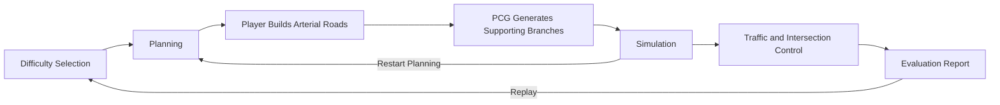
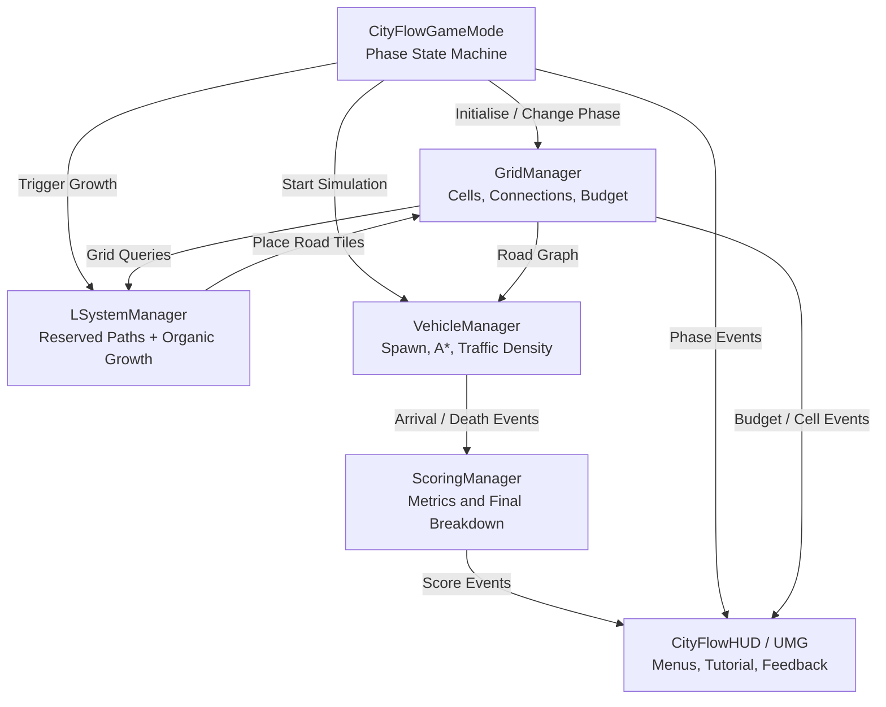
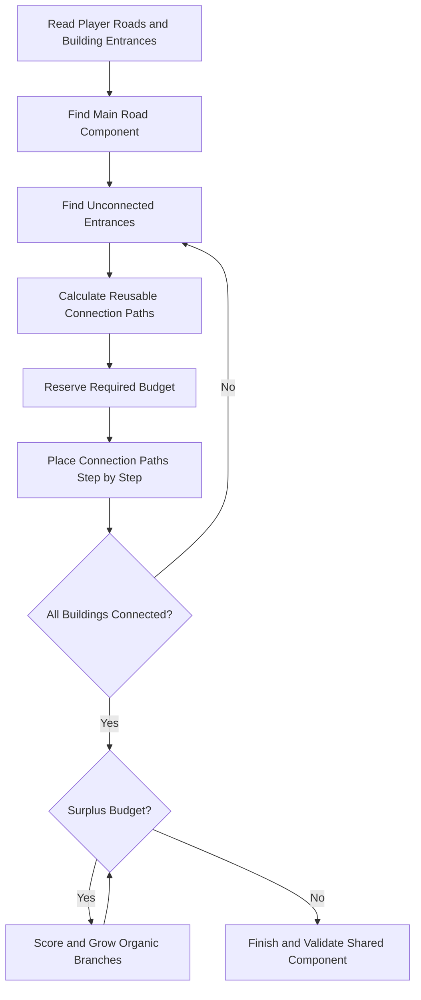

# Report Diagram Sources

These Mermaid diagrams can be previewed in a Markdown viewer and later exported as SVG or PDF for LaTeX.

## Game loop

Suggested caption: **CityFlow game loop. Player planning guides PCG growth before the road network is tested by traffic.**

## Runtime architecture

Suggested caption: **Main CityFlow runtime systems. World Subsystems share data through the grid and send events to scoring and UI.**

## Hybrid road-generation flow

Suggested caption: **Hybrid PCG process. Global connection planning protects connectivity before local L-system-inspired growth spends surplus budget.**

