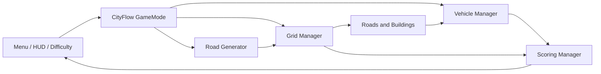

# CityFlow

> A grid-based road-planning and traffic-simulation strategy game built with Unreal Engine 5.6.


CityFlow asks the player to design an arterial road network under a limited budget, then uses procedural generation to complete the smaller connecting roads. Once planning ends, traffic is released into the city and the road network is evaluated through connectivity, traffic flow, travel efficiency, and budget use.

## Gameplay

Each match has three stages:

1. **Planning** — place and remove arterial roads on a logical grid while managing the road budget.
2. **Procedural generation** — trigger the L-system-inspired assistant to connect building entrances and grow secondary roads.
3. **Simulation and evaluation** — observe routed vehicles, congestion, intersection behaviour, and the final planning report.

Random Mode provides three presets:

| Difficulty | Buildings | Spawn interval | Runtime | Road budget |
|---|---:|---:|---:|---:|
| Easy | 8 | 0.90 s | 120 s | 220 |
| Medium | 12 | 0.65 s | 180 s | 230 |
| Hard | 16 | 0.45 s | 240 s | 240 |

Harder presets increase the absolute budget slightly, but building count and traffic pressure grow faster. This reduces the effective budget per building and makes efficient arterial planning more important.

## Main features

- **Grid-based construction** with placement previews, dragging, removal, multi-cell buildings, rotation-aware entrances, and automatic road-tile visual updates.
- **Assisted procedural road generation** that preserves a connection budget, reuses existing roads, searches for legal building connections, and spends only surplus budget on organic branches.
- **Traffic simulation** with A* route finding, spline-based movement, lane offsets, intersection reservations, queueing, congestion checks, and target-population vehicle spawning.
- **Evaluation system** covering connected buildings, largest connected network, arrivals and losses, travel efficiency, budget efficiency, runtime, and map difficulty.
- **Configurable content** through Unreal Data Assets and Project Settings, including buildings, vehicles, difficulty values, tutorials, landscape decoration, and audio routing.
- **Procedural environment support** for rivers, trees, rocks, and grass using world subsystems and hierarchical instanced static meshes.
- **Complete UI flow** with an animated main-menu city preview, difficulty selection, tutorial browser, settings, pause menu, HUD feedback, and final evaluation.
- **Native localization** using Unreal Engine's localization pipeline for English and Simplified Chinese.
- **Special vehicles** including rampage and teleport variants for additional simulation events.
- **Building showcase tools** for reviewing configured buildings on the same grid and foundation system used by gameplay.

## Controls

| Input | Action |
|---|---|
| `W` `A` `S` `D` | Move the camera |
| Mouse wheel | Zoom |
| Hold `Alt` + move mouse | Rotate the camera |
| Left mouse button / drag | Place road tiles during Planning |
| Right mouse button / drag | Remove road tiles during Planning |
| `Esc` | Open or close the pause menu |

Input is implemented with Unreal Engine Enhanced Input. The authoritative bindings are stored in `Content/Input/IMC_Default`.

## System overview



Most core runtime services are C++ `UWorldSubsystem`s. Blueprint classes provide asset references, presentation, and per-content configuration without changing the public gameplay interfaces.

### Procedural road generation

The generator is inspired by L-system growth, but uses a connectivity-first strategy suitable for gameplay:

- select the player's main road component;
- identify each building's real, rotation-aware entrance;
- reserve affordable entrance-to-network connection paths;
- count existing road reuse as zero placement cost;
- commit the reserved connection plan within the assigned budget;
- use remaining budget for controlled, attraction-biased branch growth;
- stop when every building shares a road component, the budget is exhausted, or no legal path remains.

This keeps the generator expressive while preventing decorative growth from consuming the budget needed to make the city playable.

## Requirements

- Windows 10 or 11
- Unreal Engine **5.6**
- Visual Studio 2022 with the **Game development with C++** workload
- A Windows SDK supported by Unreal Engine 5.6
- Git and [Git LFS](https://git-lfs.com/)

The project targets desktop hardware, DirectX 12, and Shader Model 6. Ray tracing is enabled in the current project configuration; hardware without ray-tracing support may require renderer-setting changes.

## Getting started

This repository stores Unreal assets and media through Git LFS. Install Git LFS before cloning so that `.uasset`, `.umap`, image, audio, and other binary files are downloaded correctly.

```powershell
git lfs install
git clone <repository-url>
cd CityFlow
git lfs pull
```

Then:

1. Right-click `CityFlow.uproject` and select **Generate Visual Studio project files**.
2. Open `CityFlow.sln` in Visual Studio 2022.
3. Select **Development Editor** and **Win64**.
4. Build the `CityFlowEditor` target.
5. Open `CityFlow.uproject` and run `Content/Map/TestMap01` in Play In Editor.

If Unreal reports that `UnrealEditor-CityFlow.dll` is in use, close the editor before rebuilding the full module, or use Live Coding for supported code changes.

### Command-line build

Set `UE_ROOT` to the Unreal Engine 5.6 installation directory, then run the following command from the repository root:

```powershell
& "$env:UE_ROOT\Engine\Build\BatchFiles\Build.bat" CityFlowEditor Win64 Development "-Project=$PWD\CityFlow.uproject" -WaitMutex
```

The default game and editor startup map is `/Game/Map/TestMap01`.

## Important editor configuration

The repository contains the C++ systems and current project assets, but new content should follow these configuration paths:

| Content | Configuration location |
|---|---|
| Buildings | `UBuildingDataAsset` and building Blueprint classes |
| Vehicles | `UVehicleDataAsset`; the default asset is configured under **Project Settings → CityFlow** |
| Gameplay and traffic defaults | **Project Settings → CityFlow** / `UCityFlowDeveloperSettings` |
| Tutorial topics | `UCityFlowTutorialDataAsset` entries with localizable text and an optional image |
| Landscape decoration | **Project Settings → CityFlow Landscape Decoration** |
| River generation | CityFlow river settings and the river world subsystem |
| Menu widgets | Blueprint widgets inheriting from the corresponding `UCityFlow*Widget` C++ class |
| Audio | Unreal Sound Classes routed through a Master class and an SFX child class |
| Localization | Unreal Localization Dashboard; staged cultures are `en` and `zh-Hans` |

For audio volume controls to affect every sound consistently, route background music through the Master class and route gameplay/UI effects through the SFX child class. Assigning only a Sound Cue without the correct Sound Class bypasses the intended SFX grouping.

## Debugging

Useful development console commands include:

| Command | Purpose |
|---|---|
| `CF_StartSimulation` | Start the simulation phase |
| `CF_EndSimulation` | End the simulation early |
| `CF_RestartPlanning` | Return to planning |
| `CF_TriggerLSystem` | Run procedural road generation |
| `CF_SpawnVehicle` | Spawn a test vehicle |
| `CF_ClearVehicles` | Remove active vehicles |
| `CF_ShowScoreStats` | Print the score breakdown |
| `CF_SetSimulationSpeed X` | Set simulation time dilation |

Additional visual-debug options are available in the CityFlow developer settings.

## Project structure

```text
CityFlow/
├── Config/                 Unreal project, gameplay, input, and packaging settings
├── Content/                Maps, Blueprints, Data Assets, UI, audio, art, and localization assets
├── Pictures/               Images used by public project documentation
├── Source/CityFlow/
│   ├── Public/             Public interfaces and data types
│   └── Private/            Runtime implementations
├── CityFlow.uproject       Unreal Engine project descriptor
├── GDD.md                  English game design document
├── GDD_Chinese.md          Chinese game design document
├── TDD.md                  English technical design document
├── TDD_Chinese.md          Chinese technical design document
└── TutorialContentGuide.md Tutorial authoring and editor configuration guide
```

The main C++ areas are `GameMode`, `Grid`, `LSystem`, `Vehicle`, `Scoring`, `Environment`, `Player`, `UI`, and `Showcase`.

## Documentation

- [Game Design Document](GDD.md)
- [游戏设计文档（中文）](GDD_Chinese.md)
- [Technical Design Document](TDD.md)
- [技术设计文档（中文）](TDD_Chinese.md)
- [Tutorial Content Guide](TutorialContentGuide.md)

## Repository status

CityFlow is an active game project. Systems, balance values, UI assets, and content configuration may continue to change. The current repository is intended for development and assessment rather than as a final packaged release.

## Third-party assets and credits

CityFlow uses the following third-party asset packs and audio. Many thanks to their creators for making these resources available.

### Buildings and vehicles

| Asset | Usage | Source |
|---|---|---|
| Car Kit | Vehicle models | [Kenney](https://www.kenney.nl/assets/car-kit) |
| City Kit (Commercial) | Building models | [Kenney](https://www.kenney.nl/assets/city-kit-commercial) |

### User interface

| Asset | Usage | Source |
|---|---|---|
| UI Pack (RPG Expansion) | Menu panels, buttons, and UI elements | [Kenney](https://www.kenney.nl/assets/ui-pack-rpg-expansion) |
| UI Pack - Pixel Adventure | Additional interface elements | [Kenney](https://www.kenney.nl/assets/ui-pack-pixel-adventure) |

### Music

| Asset | Usage | Source |
|---|---|---|
| 90's Lofi City - Lofi Music | Main background music | [Pixabay](https://pixabay.com/music/beats-90x27s-lofi-city-lofi-music-332737/) |

### Environment, roads, and visual effects

| Asset | Usage | Source |
|---|---|---|
| Stylized Mossy Ground 01A - Material | Landscape ground material | [Fab](https://www.fab.com/listings/18b5746d-dd8d-48c4-b0ec-6a61e02bf240) |
| River Forest - RAD Low Poly | Trees, rocks, plants, and river environment assets | [Fab](https://www.fab.com/listings/e8bf2cd3-1828-4860-8d0c-8ad6ec253cba) |
| Flipbook VFX | Runtime visual effects | [Fab](https://www.fab.com/listings/434162ef-4456-49d4-bfda-79b82b236171) |
| Road Blockout Kit - Modular Streets & Obstacles | Road and street assets | [Fab](https://www.fab.com/listings/dc6b14b3-f7eb-4a53-a589-eb3d5bfbb8d5) |

All third-party assets remain subject to their original licenses and redistribution terms. Consult the linked source pages before redistributing project content.

